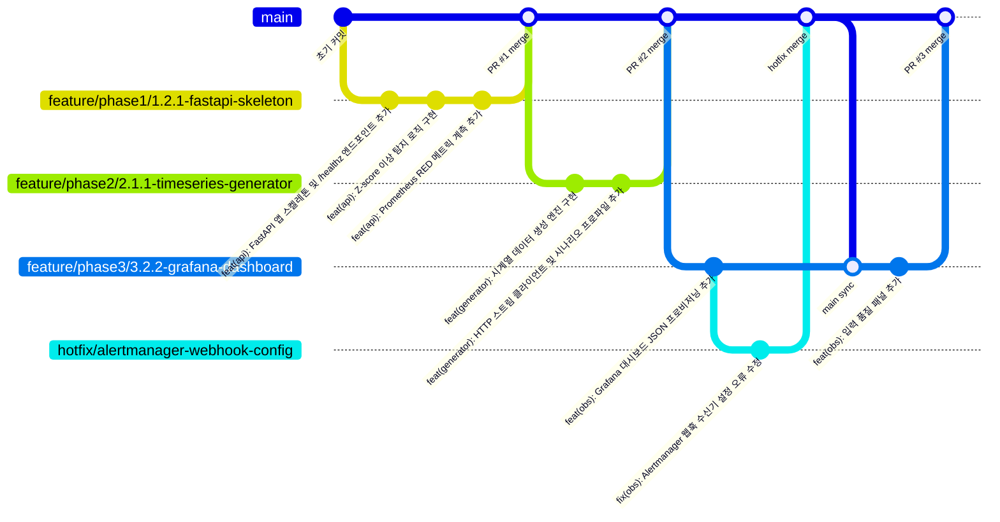
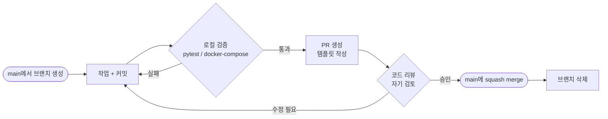
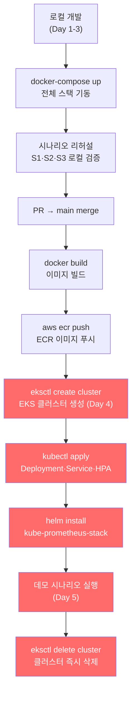

# 기여 가이드 (Contributing Guide)

> EKS 기반 C4I-Style Sensor Anomaly Observability PoC

---

## 브랜치 전략 (Git-flow)

### 브랜치 흐름



### 브랜치 명명 규칙

| 종류 | 패턴 | 예시 |
|------|------|------|
| 기능 개발 | `feature/phase{N}/{task-id}-{kebab-desc}` | `feature/phase1/1.2.3-anomaly-detection-logic` |
| 긴급 수정 | `hotfix/{kebab-desc}` | `hotfix/hpa-metrics-server-missing` |
| 문서 작업 | `docs/{kebab-desc}` | `docs/update-techstack-mermaid` |

> Task ID는 `docs/TASKS.md` 기준

---

## 커밋 컨벤션

### 형식

```
<type>(<scope>): <한국어 subject>

[optional body]

[optional footer]
```

### Type / Scope

```
type  → feat | fix | docs | chore | refactor | test | ci | perf | style
scope → api | generator | obs | db | k8s | infra | docs | ci
```

### 예시

```bash
feat(api): Z-score 기반 이상 탐지 로직 및 POST /predict 엔드포인트 추가
fix(api): PredictRequest 빈 values 배열 유효성 검사 오류 수정
feat(obs): HighErrorRate·HighLatency Prometheus 알람 룰 추가
feat(obs): RED 메트릭 및 입력 품질 패널 포함 Grafana 대시보드 프로비저닝
chore(k8s): inference-api HPA 매니페스트 추가 (CPU 50%, min:1, max:5)
feat(db): deployments·incidents·scenario_runs 테이블 init.sql 생성
test(api): 이상 탐지기 스파이크·결측 케이스 단위 테스트 추가
docs: TechStack·PLAN·TASKS 문서 및 Mermaid 다이어그램 추가
chore(infra): ap-northeast-2 t3.medium 노드 eksctl cluster.yaml 추가
```

### 규칙

- `type(scope):` 는 **영어 소문자**
- subject는 **한국어**, **72자 이내**, **마침표 없음**
- body: "왜" 변경했는지 (무엇이 아닌 이유)
- atomic commit — 하나의 커밋에 하나의 논리적 변경

---

## PR 워크플로우



### PR 제목 형식

```
{type}({scope}): {한국어 설명}
```

예시:
```
feat(api): Z-score 이상 탐지 및 /predict 엔드포인트 구현
feat(obs): Prometheus 알람 룰 및 Grafana 대시보드 통합
chore(k8s): EKS Deployment·Service·HPA 매니페스트 추가
```

### PR 체크리스트

PR 생성 전 확인:

- [ ] 브랜치명이 `feature/phase{N}/{task-id}-{desc}` 형식을 따름
- [ ] `pytest -v` 전체 통과
- [ ] `ruff check . && ruff format .` 통과
- [ ] `docker-compose up` 로컬 스택 정상 기동 확인 (해당 시)
- [ ] 관련 Task ID가 PR 본문에 명시됨
- [ ] `.env` 등 시크릿 파일이 커밋에 포함되지 않음

---

## 로컬 개발 → EKS 배포 워크플로우



> 빨간색 단계는 EKS 과금 구간입니다. Day 5 완료 즉시 클러스터를 삭제하세요.
