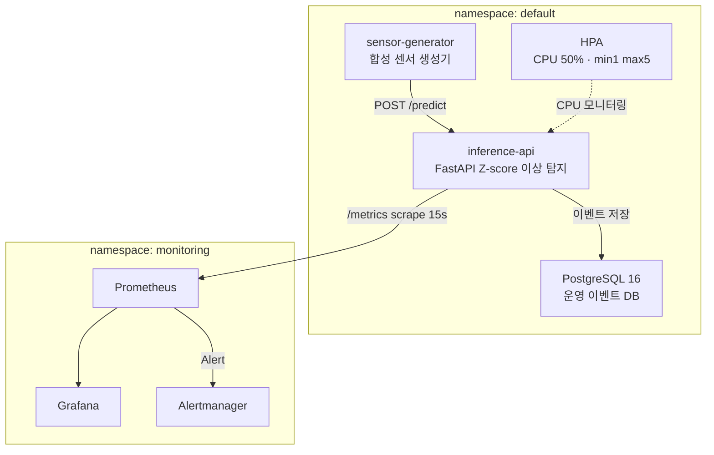

# EKS ML Observability PoC

> **FastAPI ML 추론 서비스의 관측 가능성을 로컬부터 EKS까지 직접 구축한 End-to-End PoC**
>
> Z-score 기반 센서 이상 탐지 API에 도메인 메트릭(결측률·이상률·지연·에러율)을 붙이고,
> Prometheus·Grafana로 시각화하며 Alertmanager 알람과 HPA 오토스케일링까지 검증합니다.

---

## 주요 기능

| 기능 | 설명 |
|------|------|
| Z-score 이상 탐지 | 센서 데이터의 Z-score를 계산해 이상(|z| > 2.5) 여부 판단 |
| 도메인 메트릭 계측 | HTTP 메트릭 외 `input_missing_rate`, `prediction_anomaly_rate` 직접 노출 |
| 3가지 데모 시나리오 | 부하 증가(S1) · 에러 주입(S2) · 품질 저하(S3)를 kubectl 단일 명령으로 전환 |
| Prometheus 알람 | HighLatency · HighErrorRate · HighMissingRate 알람 룰 내장 |
| HPA 오토스케일링 | CPU 50% 기준 Pod 1→5 자동 스케일아웃 |
| 운영 이벤트 DB | 배포 이력 · 인시던트 · 시나리오 실행 기록을 PostgreSQL에 저장 |

---

## 아키텍처



---

## 기술 스택

| 분류 | 기술 |
|------|------|
| 추론 API | Python 3.12, FastAPI, Uvicorn, prometheus-client |
| 센서 생성기 | Python 3.12, httpx, PyYAML |
| 관측 스택 | Prometheus, Grafana, Alertmanager, kube-prometheus-stack (Helm) |
| 데이터베이스 | PostgreSQL 16 (K8s EBS PVC) |
| 컨테이너 | Docker, AWS ECR |
| K8s / 인프라 | AWS EKS 1.31, eksctl, Helm, HPA, EBS CSI |
| 개발 도구 | uv, pytest, ruff, docker-compose |

---

## 데모 시나리오

| 시나리오 | 프로파일 전환 | 발화 알람 | 검증 포인트 |
|----------|--------------|----------|------------|
| S1 — 부하 증가 | `PROFILE=load` | — | CPU 17%→63%, HPA 1→2 replica 스케일아웃 후 32% 안정화 |
| S2 — 에러 주입 | `PROFILE=error` | HighErrorRate FIRING | 에러율 32% (422 응답), `for: 2m` 후 알람 발화 |
| S3 — 품질 저하 | `PROFILE=quality_degradation` | HighMissingRate FIRING | missing rate 50% (임계 30% 초과), 알람 발화 |

```bash
# 시나리오 전환
kubectl set env deployment/sensor-generator PROFILE=load
```

---

## 예상 비용 (EKS PoC 기준)

| 리소스 | 스펙 | 비용 |
|--------|------|------|
| EKS 제어 플레인 | — | $0.10/hr |
| m7i-flex.large × 2 | 2 vCPU / 8 GiB | ~$0.24/hr |
| EBS gp2 5Gi | PostgreSQL | ~$0.00/hr |
| **합계** | | **~$0.34/hr** |

> 데모 1회(4시간): **약 $1.4** — 종료 후 `eksctl delete cluster` 필수

---

## 시작하기

### 로컬 (docker-compose)

```bash
# 전체 스택 실행
docker-compose up -d

# 접속
# Grafana   → http://localhost:3000  (admin/admin)
# Prometheus → http://localhost:9090
# API        → http://localhost:8000/docs
```

### EKS 배포

```bash
# 1. 클러스터 생성
eksctl create cluster -f infra/eksctl/cluster.yaml

# 2. ECR 리포지토리 생성 및 이미지 푸시
./scripts/setup_ecr.sh

# 3. EBS CSI 드라이버 설치 (PostgreSQL PVC 필수)
aws eks create-addon --cluster-name sensor-obs-poc \
  --addon-name aws-ebs-csi-driver --region ap-northeast-2

# 4. K8s 매니페스트 배포
kubectl apply -f k8s/base/postgresql/
kubectl apply -f k8s/base/inference-api/
kubectl apply -f k8s/base/sensor-generator/

# 5. 모니터링 스택 설치
helm repo add prometheus-community https://prometheus-community.github.io/helm-charts
helm install kube-prometheus-stack prometheus-community/kube-prometheus-stack \
  --namespace monitoring --create-namespace \
  -f k8s/helm-values/kube-prometheus-stack.yaml

# 6. inference-api ServiceMonitor 적용 (Prometheus 스크랩 연동)
kubectl apply -f - <<EOF
apiVersion: monitoring.coreos.com/v1
kind: ServiceMonitor
metadata:
  name: inference-api
  namespace: monitoring
  labels:
    release: kube-prometheus-stack
spec:
  selector:
    matchLabels:
      app: inference-api
  endpoints:
    - port: http
      path: /metrics
      interval: 15s
  namespaceSelector:
    matchNames:
      - default
EOF

# 7. 접속 (포트포워드)
kubectl port-forward -n monitoring svc/kube-prometheus-stack-grafana 3000:80
kubectl port-forward -n monitoring svc/kube-prometheus-stack-prometheus 9090:9090

# 8. 클러스터 삭제 (비용 절약)
eksctl delete cluster --name sensor-obs-poc --region ap-northeast-2
```

### 개발 환경 세팅

```bash
# inference-api
cd inference-api
uv sync
pytest -v
ruff check . && ruff format .

# sensor-generator
cd sensor-generator
uv sync
pytest -v
```

---

## 프로젝트 구조

```
eks-ml-observability-poc/
├── inference-api/          # FastAPI 추론 서비스
│   ├── app/                # main, detector, metrics, db
│   └── tests/              # 단위·통합 테스트
├── sensor-generator/       # 합성 센서 생성기
│   ├── sensor_generator/   # 생성기 패키지
│   └── profiles/           # 시나리오 YAML 프로파일
├── observability/          # 로컬 관측 스택 설정
│   ├── prometheus/         # prometheus.yml, alerting_rules.yml
│   ├── grafana/            # 대시보드 JSON, 프로비저닝 설정
│   └── alertmanager/       # alertmanager.yml
├── k8s/
│   ├── base/               # Deployment, Service, HPA, PVC, ConfigMap
│   │   ├── inference-api/
│   │   ├── postgresql/
│   │   └── sensor-generator/
│   └── helm-values/        # kube-prometheus-stack values (알람룰 포함)
├── infra/eksctl/           # EKS 클러스터 설정 YAML
├── scripts/                # setup_ecr.sh, 검증 테스트
├── docs/
│   ├── PLAN.md             # 5일 구현 계획
│   ├── TASKS.md            # Epic/Task 분해 목록
│   └── TechStack.md        # 기술 스택 매트릭스
└── notes/                  # 작업 로그, 블로그 초안, 포트폴리오
```

---

## 문서

| 문서 | 내용 |
|------|------|
| [구현 계획](docs/PLAN.md) | 5일 Phase별 구현 계획 |
| [Task 분해](docs/TASKS.md) | Epic/Task DoD 체크리스트 |
| [기술 스택](docs/TechStack.md) | 기술 선택 근거 매트릭스 |
