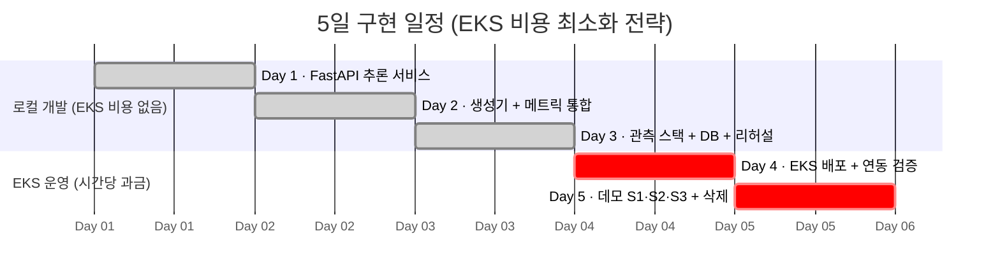
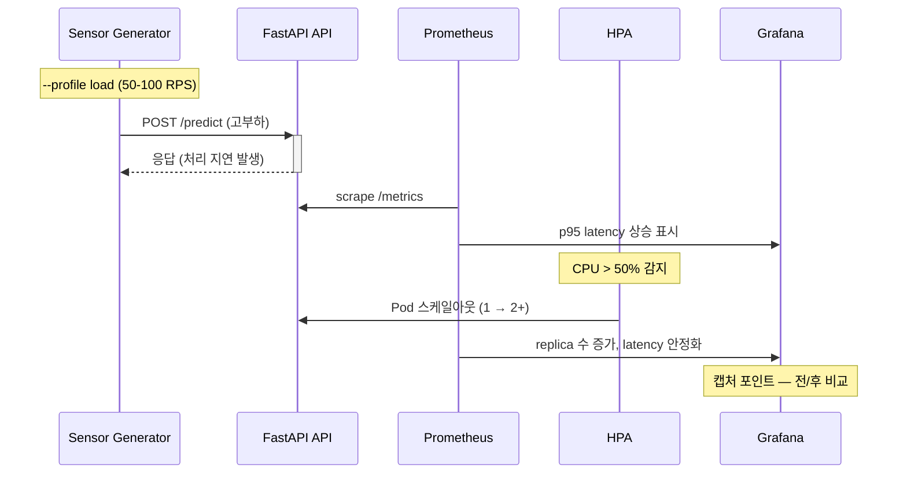
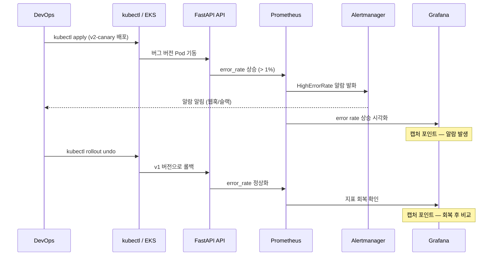
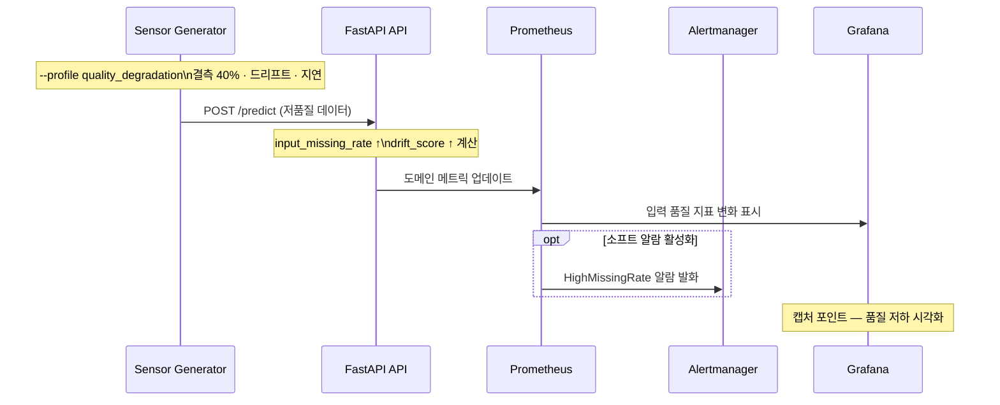

# 5일 구현 계획 (Implementation Plan)

> PRD 참조: EKS 기반 C4I-Style Sensor Anomaly Observability PoC
>
> 핵심 원칙: Day 1-3은 로컬 개발(EKS 비용 0원), Day 4-5는 EKS 배포 및 데모 실행

---

## 일정 개요

| Day | 핵심 목표 | 환경 | EKS 비용 |
|-----|----------|------|---------|
| Day 1 | 로컬 개발 환경 구축 + FastAPI 추론 서비스 완성 | 로컬 | 없음 |
| Day 2 | 합성 센서 생성기 + Prometheus 메트릭 통합 | 로컬 (docker-compose) | 없음 |
| Day 3 | 관측 스택 통합 + PostgreSQL + 알람 + 로컬 리허설 | 로컬 (docker-compose) | 없음 |
| Day 4 | EKS 클러스터 생성 + 컨테이너 빌드/배포 + 관측 스택 배포 | EKS | 발생 시작 |
| Day 5 | 데모 시나리오(S1/S2/S3) 실행 + 산출물 정리 + 클러스터 삭제 | EKS | 완료 후 즉시 삭제 |

### 일정 시각화 (Gantt)

---

## Day 1: 로컬 개발 환경 + FastAPI 추론 서비스

### 목표
- 프로젝트 디렉토리 구조 확정 및 개발 도구 셋업 (uv, ruff, pytest)
- FastAPI 추론 서비스 핵심 3개 엔드포인트 구현 (`/healthz`, `/predict`, `/metrics`)
- Z-score 기반 경량 이상 탐지 로직 구현
- Dockerfile 작성 (멀티스테이지 빌드)
- 단위 테스트 작성 및 통과

### 주요 산출물

| 산출물 | 경로/형태 |
|--------|----------|
| 프로젝트 구조 | 디렉토리 레이아웃 확정 |
| 추론 서비스 코드 | `inference-api/app/` |
| Dockerfile | `inference-api/Dockerfile` |
| 테스트 코드 | `inference-api/tests/` |
| 의존성 정의 | `inference-api/pyproject.toml` |

### 검증 포인트
- [ ] `uvicorn app.main:app --reload` 실행 후 `/healthz` 가 `{"status": "ok"}` 반환
- [ ] `/predict` 에 정상 window 데이터 전송 시 `anomaly_score`, `is_anomaly`, `reason` 포함 JSON 응답
- [ ] `/predict` 에 스파이크가 포함된 데이터 전송 시 `is_anomaly: true` 반환
- [ ] `/metrics` 접속 시 `request_count`, `request_latency_seconds` 등 Prometheus 형식 텍스트 출력
- [ ] `pytest -v` 전체 테스트 통과 (최소 5개 테스트 케이스)
- [ ] `docker build` 성공 및 컨테이너 내 `/healthz` 응답 확인

### 리스크 및 대응

| 리스크 | 영향도 | 대응 방안 |
|--------|--------|----------|
| 이상 탐지 알고리즘 설계에 시간 소요 | 중 | Z-score 단일 방식 우선 구현. IQR/이동평균은 Day 2-3에 추가. |
| Pydantic v2 마이그레이션 이슈 | 낮 | FastAPI 최신 버전은 Pydantic v2 기본 지원. |

---

## Day 2: 합성 센서 생성기 + Prometheus 메트릭 통합

### 목표
- 합성 센서 스트림 생성기 구현 (정상/이상 시나리오 파라미터 기반)
- 추론 서비스에 도메인 메트릭 추가 (`input_missing_rate`, `input_delay_ms`, `drift_score`, `anomaly_rate`)
- docker-compose 로 추론 서비스 + 생성기 2개 서비스 연동
- 시나리오 S1(부하), S2(에러), S3(품질 저하) 각각에 맞는 생성기 프로파일 정의

### 주요 산출물

| 산출물 | 경로/형태 |
|--------|----------|
| 생성기 코드 | `sensor-generator/` |
| 시나리오 프로파일 | `sensor-generator/profiles/` (YAML) |
| docker-compose (v1) | `docker-compose.yml` (추론 API + 생성기) |
| 도메인 메트릭 코드 | `inference-api/app/metrics.py` 확장 |

### 검증 포인트
- [ ] `python -m sensor_generator --mode normal` 실행 시 추론 서비스에 요청 전송 확인 (로그)
- [ ] `--mode spike` 모드에서 anomaly_rate 상승 확인 (`/metrics` 조회)
- [ ] `--mode missing` 모드에서 `input_missing_rate` 메트릭 값 상승 확인
- [ ] `--mode drift` 모드에서 `drift_score` 메트릭 값 변화 확인
- [ ] `docker-compose up` 으로 두 서비스 동시 기동, 생성기가 추론 서비스에 요청 전송
- [ ] `/metrics` 에서 `input_missing_rate`, `input_delay_ms`, `drift_score`, `anomaly_rate` 4개 메트릭 모두 노출

### 리스크 및 대응

| 리스크 | 영향도 | 대응 방안 |
|--------|--------|----------|
| 시나리오 파라미터 튜닝 시간 초과 | 중 | S1(부하) 우선 완성, S2/S3은 Day 3 오전에 마무리 |
| drift_score 계산 로직 복잡도 | 중 | 간단한 평균/분산 비교 방식으로 시작. KL-divergence 등은 선택 사항. |
| 비동기 HTTP 클라이언트 에러 핸들링 | 낮 | httpx 타임아웃 3초, 최대 재시도 2회 설정 |

---

## Day 3: 관측 스택 + PostgreSQL + 로컬 전체 통합

### 목표
- Prometheus + Grafana + Alertmanager를 docker-compose에 추가
- Prometheus 스크랩 설정 및 추론 서비스 타겟 등록
- Alerting Rules 3종 정의 (error rate, p95 latency, input_missing_rate)
- Grafana 대시보드 프로비저닝 (RED 메트릭 + 입력 품질 + 리소스)
- PostgreSQL 컨테이너 + 스키마 생성 (deployments, incidents, scenario_runs)
- 운영 이벤트 기록 API 구현
- 로컬 환경에서 전체 E2E 통합 테스트 및 시나리오 리허설

### 주요 산출물

| 산출물 | 경로/형태 |
|--------|----------|
| Prometheus 설정 | `observability/prometheus/prometheus.yml` |
| 알람 룰 | `observability/prometheus/alerting_rules.yml` |
| Alertmanager 설정 | `observability/alertmanager/alertmanager.yml` |
| Grafana 대시보드 | `observability/grafana/dashboards/sensor-anomaly.json` |
| Grafana 프로비저닝 | `observability/grafana/provisioning/` |
| DB 스키마 | `db/init.sql` 또는 `inference-api/app/db/` |
| docker-compose (전체) | `docker-compose.yml` (6개 서비스) |

### 검증 포인트
- [ ] `docker-compose up` 으로 6개 서비스(추론 API, 생성기, Prometheus, Grafana, Alertmanager, PostgreSQL) 전체 기동
- [ ] Prometheus UI (`localhost:9090`) > Targets 에서 추론 서비스 `UP` 상태
- [ ] Prometheus UI에서 `request_count` PromQL 쿼리 결과 확인
- [ ] Grafana (`localhost:3000`) 로그인 후 대시보드에서 RPS, error rate, p95 latency 그래프 렌더링
- [ ] Grafana 대시보드에서 `input_missing_rate`, `drift_score` 패널 렌더링
- [ ] 의도적 에러 주입(생성기 에러 모드) 후 Alertmanager UI에서 알람 발생 확인
- [ ] PostgreSQL에 `deployments`, `incidents`, `scenario_runs` 테이블 존재 확인
- [ ] 운영 이벤트 API로 INSERT 후 SELECT 결과 반환 확인
- [ ] S1/S2/S3 시나리오 로컬 리허설 1회 이상 완료

### 리스크 및 대응

| 리스크 | 영향도 | 대응 방안 |
|--------|--------|----------|
| Grafana 대시보드 구성 시간 초과 | 중 | 커뮤니티 RED 대시보드 JSON을 기반으로 커스터마이징. 직접 제작 최소화. |
| Alertmanager 알람 미발생 | 중 | 임계치를 의도적으로 낮게 설정하여 확실한 트리거 보장. |
| docker-compose 리소스 부족 (메모리) | 중 | Prometheus retention 1h, Grafana 메모리 제한 256MB 설정. |
| DB 마이그레이션 복잡도 | 낮 | 3개 테이블뿐이므로 Alembic 없이 init.sql로 직접 생성 가능. |

---

## Day 4: EKS 인프라 + 컨테이너 빌드/배포

### 목표
- EKS 클러스터 생성 (eksctl, t3.medium x 2)
- ECR 리포지토리 생성 및 Docker 이미지 푸시
- K8s 매니페스트 작성/배포 (Deployment, Service, HPA, ConfigMap)
- kube-prometheus-stack Helm 차트 배포 (Prometheus + Grafana + Alertmanager)
- PostgreSQL Pod 배포
- EKS 환경에서 전체 서비스 동작 확인
- metrics-server 설치 및 HPA 동작 사전 확인

### 주요 산출물

| 산출물 | 경로/형태 |
|--------|----------|
| 클러스터 설정 | `infra/eksctl/cluster.yaml` |
| K8s 매니페스트 | `k8s/base/` (deployment, service, hpa, configmap) |
| Helm values | `k8s/helm-values/kube-prometheus-stack.yaml` |
| PostgreSQL 매니페스트 | `k8s/base/postgresql/` |
| 배포 스크립트 | `scripts/deploy.sh` |

### 검증 포인트
- [ ] `eksctl create cluster` 완료 (노드 2대 Ready)
- [ ] `aws ecr get-login-password` 성공, 이미지 푸시 완료
- [ ] `kubectl get pods` 추론 서비스 Pod `Running` 상태
- [ ] `kubectl get hpa` HPA 리소스 생성 확인, `TARGETS` 열에 CPU% 표시
- [ ] 추론 서비스 `port-forward` 후 `/healthz` 200 OK
- [ ] Prometheus targets에서 EKS 내 추론 서비스 `UP`
- [ ] Grafana 접근 가능(port-forward), 대시보드에 데이터 렌더링 시작
- [ ] PostgreSQL Pod 접속 후 테이블 존재 확인
- [ ] 생성기 Pod 또는 로컬에서 EKS 추론 서비스로 요청 전송 성공

### 리스크 및 대응

| 리스크 | 영향도 | 대응 방안 |
|--------|--------|----------|
| EKS 클러스터 생성 15-20분 소요 | 중 | 오전 첫 작업으로 즉시 시작. 대기 중 K8s 매니페스트 최종 점검. |
| ECR 권한 이슈 (IAM) | 중 | 사전에 `aws sts get-caller-identity`로 권한 확인. ECR 정책 설정. |
| kube-prometheus-stack 리소스 부족 | 높 | node-exporter DaemonSet, kube-state-metrics 등 불필요 컴포넌트 최소화. 리소스 request/limit 조정. |
| metrics-server 미설치 | 중 | `kubectl apply -f https://github.com/kubernetes-sigs/metrics-server/releases/latest/download/components.yaml` 별도 실행. |
| LoadBalancer 프로비저닝 지연 | 낮 | NodePort 또는 port-forward로 대체. |

---

## Day 5: 데모 시나리오 실행 + 산출물 정리 + 클러스터 삭제

### 목표
- **S1 시나리오**: 부하 증가 -> p95 latency 상승 -> HPA 스케일아웃 -> 지표 안정화 (전/후 캡처)
- **S2 시나리오**: 카나리(버그) 버전 배포 -> error rate 상승 -> 알람 발생 -> 롤백 -> 지표 회복 (전/후 캡처)
- **S3 시나리오**: 입력 품질 저하 주입 -> `input_missing_rate`, `drift_score` 변화 관측 (캡처)
- PostgreSQL 운영 이벤트 기록 확인 및 조회 캡처
- 데모 녹화 (3-5분)
- 운영 리포트 작성 (전/후 지표 비교)
- **EKS 클러스터 즉시 삭제** (비용 차단)

### 주요 산출물

| 산출물 | 형태 |
|--------|------|
| S1 전/후 스크린샷 | Grafana: HPA replica 수 변화, p95 latency 변화 |
| S2 전/후 스크린샷 | Grafana: error rate 상승/회복, Alertmanager 알람 발생 |
| S3 스크린샷 | Grafana: input_missing_rate, drift_score 변화 |
| 알람 증거 | Alertmanager UI 스크린샷 또는 로그 |
| DB 조회 캡처 | PostgreSQL 운영 이벤트 SELECT 결과 |
| 데모 영상 | S1 -> S2 -> S3 순서, 3-5분 |
| 운영 리포트 | `docs/REPORT.md` (전/후 지표 비교 표) |

### 검증 포인트 (= PRD 성공 기준 D1-D5 매핑)
- [ ] **D1**: EKS 배포 성공 캡처 (`kubectl get all` 출력) + HPA가 replica 1 -> 2+ 스케일아웃하는 장면 캡처
- [ ] **D2**: Grafana 대시보드 스크린샷 1장 이상 (RED 메트릭 + 입력 품질 메트릭 동시 표시)
- [ ] **D3**: 알람 2종 이상 실제 발생 증거 (error rate 알람 + latency 알람 또는 input_missing_rate 알람)
- [ ] **D4**: S2에서 롤백 전/후 error rate 비교 캡처 OR S1에서 스케일 전/후 latency 비교 캡처
- [ ] **D5**: PostgreSQL `scenario_runs` 테이블 조회 결과에 S1/S2/S3 실행 기록 존재

### 시나리오 흐름 다이어그램

**S1 — 부하 증가 → HPA 스케일아웃**

**S2 — 에러 주입 → 알람 → 롤백**

**S3 — 입력 품질 저하 → 도메인 메트릭 변화**

### 시나리오 실행 순서 및 타임라인 (권장)

| 시각 (예시) | 작업 | 소요 시간 |
|------------|------|----------|
| 09:00 | 사전 점검: 모든 Pod Running, Prometheus/Grafana 정상 | 15분 |
| 09:15 | **S1 실행**: 부하 생성 시작 -> 대기(5분) -> HPA 관찰 -> 캡처 | 30분 |
| 09:45 | **S2 실행**: 버그 버전 배포 -> 에러 관찰 -> 알람 확인 -> 롤백 -> 캡처 | 30분 |
| 10:15 | **S3 실행**: 품질 저하 주입 -> 메트릭 변화 관찰 -> 캡처 | 20분 |
| 10:35 | PostgreSQL 이벤트 기록 확인 및 캡처 | 10분 |
| 10:45 | 데모 영상 녹화 (필요 시 재실행 포함) | 45분 |
| 11:30 | 운영 리포트 작성 | 30분 |
| 12:00 | 산출물 정리, README 최종 업데이트 | 30분 |
| 12:30 | **EKS 클러스터 삭제** (`eksctl delete cluster`) | 15분 |
| 12:45 | 삭제 확인 (CloudFormation 콘솔) + 완료 | 15분 |

### 리스크 및 대응

| 리스크 | 영향도 | 대응 방안 |
|--------|--------|----------|
| HPA 스케일아웃 반응 지연 (기본 15초 주기) | 중 | `--horizontal-pod-autoscaler-sync-period` 단축 또는 충분한 부하 지속 (5분+) |
| 알람이 발생하지 않음 | 높 | Day 3 리허설에서 임계치 확정. `for: 1m`으로 단축 가능. |
| 녹화 중 예상치 못한 장애 | 중 | 로컬 리허설 기반 스크립트화. 실패 시 재실행. |
| 클러스터 삭제 실패 | 높 | CloudFormation 콘솔에서 수동 삭제. VPC/ELB 잔존 리소스 확인. |

---

## 비용 추정

| 항목 | 단가 | 예상 사용량 | 예상 비용 |
|------|------|------------|----------|
| EKS 컨트롤 플레인 | $0.10/hr | 16시간 (Day 4-5) | ~$1.60 |
| EC2 t3.medium x 2 | $0.0416/hr x 2 | 16시간 | ~$1.33 |
| ECR 스토리지 | $0.10/GB/월 | < 1GB | ~$0.10 |
| NAT Gateway (선택) | $0.045/hr | 16시간 | ~$0.72 |
| **총합** | | | **~$3.75** |

> 비용 핵심 원칙: Day 4 오전 클러스터 생성, Day 5 오후 클러스터 삭제. 최대 16시간 운영.

---

## 클러스터 삭제 체크리스트

Day 5 데모 완료 후 반드시 수행:

- [ ] `eksctl delete cluster --name sensor-obs-poc --region ap-northeast-2`
- [ ] AWS CloudFormation 콘솔에서 관련 스택 삭제 완료 확인
- [ ] ECR 리포지토리 삭제 (`aws ecr delete-repository --force`)
- [ ] ELB(LoadBalancer) 잔존 여부 확인 후 삭제
- [ ] CloudWatch 로그 그룹 정리 (선택)
