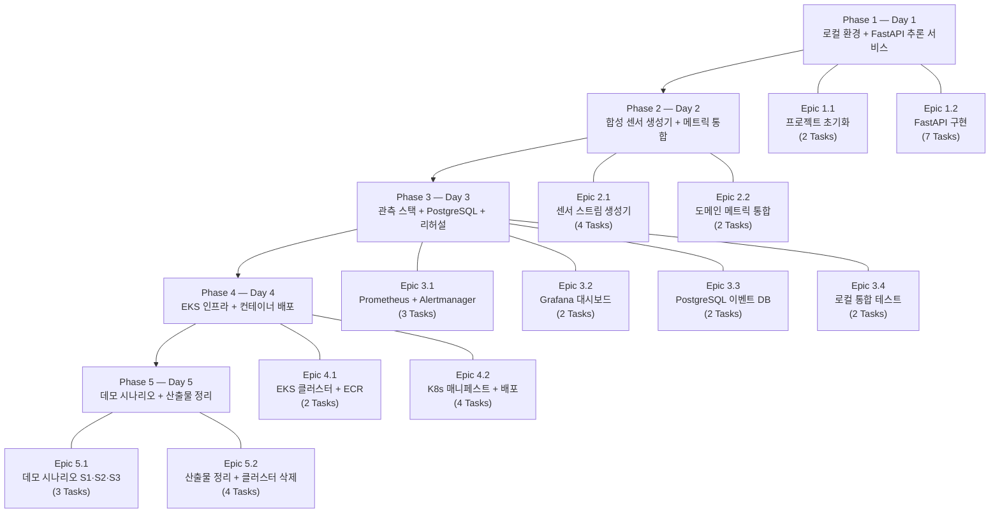

# 작업 분해 (Task Breakdown)

> PRD 참조: EKS 기반 C4I-Style Sensor Anomaly Observability PoC
>
> 구조: Phase > Epic > Task
> 총 Task 수: 34개

---

## Phase > Epic 전체 구조

---

# Phase 1: 로컬 개발 환경 + FastAPI 추론 서비스 (Day 1)

## Epic 1.1: 프로젝트 초기화 및 개발 환경 셋업

### Task 1.1.1: 프로젝트 디렉토리 구조 생성
- **설명**: 모노레포 형태의 프로젝트 디렉토리 구조를 확정하고 생성한다. `inference-api/`, `sensor-generator/`, `observability/`, `k8s/`, `infra/`, `scripts/`, `docs/` 디렉토리를 포함한다.
- **DoD (완료 정의)**:
  - [x] 디렉토리 구조가 README.md에 문서화됨
  - [x] .gitignore 파일 생성 (Python, Docker, IDE 패턴 포함)
  - [x] 각 서브 디렉토리에 빈 __init__.py 또는 .gitkeep 존재
- **산출물/캡처 포인트**: 프로젝트 루트의 `tree` 명령 출력 캡처
- **예상 소요**: 0.5h

### Task 1.1.2: Python 개발 환경 설정
- **설명**: uv를 사용하여 inference-api 프로젝트의 Python 환경을 구성한다. FastAPI, uvicorn, numpy, scipy, prometheus-client, pytest, httpx, ruff 등 의존성을 정의한다.
- **DoD (완료 정의)**:
  - [ ] `pyproject.toml` 파일 생성 (모든 의존성 명시)
  - [ ] `uv sync` 성공
  - [ ] `ruff check .` 실행 가능
  - [ ] `pytest --version` 실행 가능
- **산출물/캡처 포인트**: `pyproject.toml` 파일 내용
- **예상 소요**: 0.5h

---

## Epic 1.2: FastAPI 추론 서비스 구현

### Task 1.2.1: FastAPI 앱 스켈레톤 및 /healthz 엔드포인트
- **설명**: FastAPI 앱의 기본 구조를 생성한다. `app/main.py`에 앱 인스턴스를 생성하고, `GET /healthz` 엔드포인트를 구현하여 `{"status": "ok"}` 를 반환한다.
- **DoD (완료 정의)**:
  - [ ] `uvicorn app.main:app --reload` 실행 성공
  - [ ] `GET /healthz` 가 200 OK + `{"status": "ok"}` 반환
  - [ ] `GET /docs` 에서 Swagger UI 접근 가능
- **산출물/캡처 포인트**: `/healthz` curl 응답 캡처
- **예상 소요**: 0.5h

### Task 1.2.2: 입출력 스키마 정의 (Pydantic 모델)
- **설명**: `/predict` 엔드포인트의 요청/응답 Pydantic 모델을 정의한다. 요청: `sensor_id (str)`, `timestamp (datetime)`, `values (list[float])`, `missing_flags (list[bool], optional)`. 응답: `anomaly_score (float)`, `is_anomaly (bool)`, `reason (str)`.
- **DoD (완료 정의)**:
  - [ ] `app/schemas.py` 에 PredictRequest, PredictResponse 모델 정의
  - [ ] Pydantic 유효성 검증 동작 확인 (잘못된 타입 입력 시 422 반환)
  - [ ] 빈 values 배열에 대한 검증 규칙 존재
- **산출물/캡처 포인트**: 스키마 코드 및 422 에러 응답 예시
- **예상 소요**: 0.5h

### Task 1.2.3: 이상 탐지 로직 구현 (Z-score 기반)
- **설명**: `app/detector.py`에 경량 통계 기반 이상 탐지 로직을 구현한다. Z-score 방식으로 window 내 값의 이상 여부를 판단한다. 임계값(threshold)은 설정 가능하게 한다. 결측률(missing_rate)과 분산 변화(drift_score)도 계산한다.
- **DoD (완료 정의)**:
  - [ ] `detect_anomaly(values, missing_flags)` 함수 구현
  - [ ] 정상 데이터 입력 시 `is_anomaly=False` 반환
  - [ ] 스파이크 데이터 입력 시 `is_anomaly=True`, `reason="variance_spike"` 반환
  - [ ] 결측률 높은 입력 시 `reason="missing_rate_high"` 반환
  - [ ] 단위 테스트 3개 이상 통과
- **산출물/캡처 포인트**: 탐지 로직 코드 및 테스트 결과
- **예상 소요**: 1.5h

### Task 1.2.4: POST /predict 엔드포인트 구현
- **설명**: `/predict` 엔드포인트를 구현하여 PredictRequest를 받고, 이상 탐지 로직을 호출한 뒤, PredictResponse를 반환한다. 처리 시간을 측정하여 로깅한다.
- **DoD (완료 정의)**:
  - [ ] `POST /predict` 가 정상 요청에 대해 200 + PredictResponse 반환
  - [ ] 잘못된 요청에 대해 422 반환
  - [ ] 처리 시간 로그 출력
  - [ ] Swagger UI에서 인터랙티브 테스트 가능
- **산출물/캡처 포인트**: `/predict` 정상/이상 요청 curl 응답 캡처
- **예상 소요**: 1h

### Task 1.2.5: Prometheus 메트릭 계측 (RED 메트릭)
- **설명**: `prometheus-client`를 사용하여 HTTP RED 메트릭을 계측한다. `request_count` (Counter, labels: method, endpoint, status), `request_latency_seconds` (Histogram, labels: endpoint). `/metrics` 엔드포인트를 노출한다.
- **DoD (완료 정의)**:
  - [ ] `GET /metrics` 가 Prometheus exposition format 텍스트 반환
  - [ ] `/predict` 호출 후 `request_count` 증가 확인
  - [ ] `/predict` 호출 후 `request_latency_seconds` 히스토그램 버킷에 값 존재
  - [ ] `app_version` info gauge 노출
- **산출물/캡처 포인트**: `/metrics` 응답 일부 캡처
- **예상 소요**: 1h

### Task 1.2.6: Dockerfile 작성
- **설명**: 추론 서비스용 멀티스테이지 Dockerfile을 작성한다. 빌드 스테이지에서 의존성 설치, 런타임 스테이지에서 `python:3.12-slim` 기반 최소 이미지 구성.
- **DoD (완료 정의)**:
  - [ ] `docker build -t inference-api .` 성공
  - [ ] `docker run` 후 `/healthz` 200 OK
  - [ ] 최종 이미지 크기 200MB 이하
  - [ ] 비root 사용자로 실행
- **산출물/캡처 포인트**: `docker images` 출력 (이미지 크기)
- **예상 소요**: 0.5h

### Task 1.2.7: 단위 테스트 작성
- **설명**: pytest를 사용하여 추론 서비스의 단위/통합 테스트를 작성한다. 이상 탐지 로직 테스트, API 엔드포인트 테스트를 포함한다.
- **DoD (완료 정의)**:
  - [ ] 이상 탐지 로직 테스트: 정상, 스파이크, 결측, 드리프트 각 1개 이상
  - [ ] API 엔드포인트 테스트: /healthz, /predict 정상, /predict 에러 각 1개 이상
  - [ ] `pytest -v` 전체 통과 (최소 7개 테스트)
  - [ ] 테스트 커버리지 핵심 로직 80% 이상
- **산출물/캡처 포인트**: `pytest -v` 출력 캡처
- **예상 소요**: 1h

---

# Phase 2: 합성 센서 생성기 + Prometheus 메트릭 통합 (Day 2)

## Epic 2.1: 합성 센서 스트림 생성기

### Task 2.1.1: 시계열 데이터 생성 엔진
- **설명**: numpy를 사용하여 합성 센서 시계열 데이터를 생성하는 엔진을 구현한다. 기본 패턴(사인파 + 노이즈)에 이상 패턴(스파이크, 드리프트, 결측, 노이즈 증가)을 파라미터 기반으로 주입한다.
- **DoD (완료 정의)**:
  - [ ] `generate_normal(window_size)` : 정상 시계열 반환
  - [ ] `generate_spike(window_size, spike_magnitude)` : 스파이크 포함 시계열 반환
  - [ ] `generate_drift(window_size, drift_rate)` : 드리프트 포함 시계열 반환
  - [ ] `generate_missing(window_size, missing_rate)` : NaN/결측 포함 시계열 반환
  - [ ] 단위 테스트 4개 이상 통과
- **산출물/캡처 포인트**: 생성된 시계열 데이터 샘플 출력 (정상 vs 이상)
- **예상 소요**: 1.5h

### Task 2.1.2: HTTP 스트림 클라이언트 구현
- **설명**: httpx async 클라이언트를 사용하여 생성된 시계열 데이터를 추론 서비스 `/predict` 엔드포인트에 전송하는 스트리밍 클라이언트를 구현한다. RPS(초당 요청 수)를 조절 가능하게 한다.
- **DoD (완료 정의)**:
  - [ ] 지정된 RPS로 `/predict` 에 요청 전송
  - [ ] 응답 로깅 (anomaly_score, is_anomaly)
  - [ ] 에러 발생 시 재시도 로직 (최대 2회)
  - [ ] 타임아웃 설정 (3초)
- **산출물/캡처 포인트**: 클라이언트 실행 시 콘솔 로그 캡처
- **예상 소요**: 1h

### Task 2.1.3: 시나리오 프로파일 정의 및 CLI
- **설명**: S1(부하), S2(에러), S3(품질 저하) 시나리오에 대응하는 생성기 프로파일을 YAML 파일로 정의한다. typer CLI를 통해 `--profile` 옵션으로 프로파일을 선택할 수 있게 한다.
- **DoD (완료 정의)**:
  - [ ] `profiles/normal.yaml` : 정상 트래픽 (10 RPS, 이상 0%)
  - [ ] `profiles/load.yaml` : 부하 트래픽 (50-100 RPS, 이상 5%)
  - [ ] `profiles/error.yaml` : 에러 유발 (잘못된 입력 30%)
  - [ ] `profiles/quality_degradation.yaml` : 결측 40%, 드리프트, 지연
  - [ ] CLI `python -m sensor_generator --profile normal` 실행 가능
- **산출물/캡처 포인트**: 각 프로파일 YAML 내용 및 CLI `--help` 출력
- **예상 소요**: 1h

### Task 2.1.4: 생성기 Dockerfile 작성
- **설명**: 합성 센서 생성기를 컨테이너로 빌드할 수 있도록 Dockerfile을 작성한다.
- **DoD (완료 정의)**:
  - [ ] `docker build -t sensor-generator .` 성공
  - [ ] 환경 변수로 타겟 URL, 프로파일 지정 가능
  - [ ] `docker run` 시 추론 서비스로 요청 전송 확인
- **산출물/캡처 포인트**: `docker images` 출력
- **예상 소요**: 0.5h

---

## Epic 2.2: 도메인 메트릭 통합

### Task 2.2.1: 도메인 메트릭 계측 추가
- **설명**: 추론 서비스에 도메인 메트릭을 추가한다. `input_missing_rate` (Gauge), `input_delay_ms` (Histogram), `drift_score` (Gauge), `anomaly_rate` (Gauge). 각 `/predict` 요청 처리 시 메트릭을 업데이트한다.
- **DoD (완료 정의)**:
  - [ ] `/metrics`에 `input_missing_rate`, `input_delay_ms`, `drift_score`, `anomaly_rate` 4개 메트릭 노출
  - [ ] 결측 데이터 요청 시 `input_missing_rate` 값 상승 확인
  - [ ] 정상 요청 시 `anomaly_rate` 낮은 값 유지 확인
  - [ ] 모든 메트릭에 `sensor_id` 라벨 포함
- **산출물/캡처 포인트**: `/metrics` 엔드포인트에서 도메인 메트릭 노출 확인 캡처
- **예상 소요**: 1h

### Task 2.2.2: docker-compose 기본 구성 (추론 API + 생성기)
- **설명**: docker-compose.yml에 추론 서비스와 생성기 두 서비스를 정의한다. 네트워크로 연결하여 생성기가 추론 서비스에 요청을 전송하도록 구성한다.
- **DoD (완료 정의)**:
  - [ ] `docker-compose up` 으로 두 서비스 동시 기동
  - [ ] 생성기 로그에 추론 서비스 응답 출력
  - [ ] 추론 서비스 `/metrics`에 요청 카운트 증가
  - [ ] `docker-compose down` 으로 정상 종료
- **산출물/캡처 포인트**: `docker-compose up` 로그 캡처 (두 서비스 상호 작용)
- **예상 소요**: 1h

---

# Phase 3: 관측 스택 + PostgreSQL (Day 3)

## Epic 3.1: Prometheus + Alertmanager 구성

### Task 3.1.1: Prometheus 스크랩 설정
- **설명**: Prometheus 설정 파일(`prometheus.yml`)을 작성하여 추론 서비스의 `/metrics` 엔드포인트를 스크랩 타겟으로 등록한다. 스크랩 간격 15초.
- **DoD (완료 정의)**:
  - [ ] `prometheus.yml` 파일 생성
  - [ ] Prometheus UI > Targets에서 추론 서비스 `UP` 상태
  - [ ] Prometheus UI > Graph에서 `request_count` 쿼리 결과 존재
  - [ ] 도메인 메트릭(`input_missing_rate` 등) 쿼리 가능
- **산출물/캡처 포인트**: Prometheus Targets 페이지 스크린샷
- **예상 소요**: 0.5h

### Task 3.1.2: Alerting Rules 정의
- **설명**: Prometheus alerting rules 파일(`alerting_rules.yml`)을 작성한다. 최소 3개 알람: (1) error rate > 1% (5m), (2) p95 latency > 200ms (5m), (3) input_missing_rate > 0.3 (5m).
- **DoD (완료 정의)**:
  - [ ] `alerting_rules.yml` 파일 생성
  - [ ] Prometheus UI > Alerts에서 3개 룰 표시
  - [ ] 모든 룰이 `inactive` 상태 (정상 시)
  - [ ] PromQL 표현식 문법 오류 없음
- **산출물/캡처 포인트**: Prometheus Alerts 페이지 스크린샷
- **예상 소요**: 1h

### Task 3.1.3: Alertmanager 설정 및 연동
- **설명**: Alertmanager 설정 파일(`alertmanager.yml`)을 작성한다. 웹훅 수신기(webhook receiver)를 기본으로 설정한다. Prometheus가 Alertmanager에 알람을 전송하도록 연동한다.
- **DoD (완료 정의)**:
  - [ ] `alertmanager.yml` 파일 생성
  - [ ] Prometheus 설정에 alertmanager 타겟 등록
  - [ ] Alertmanager UI (`localhost:9093`) 접근 가능
  - [ ] 의도적 에러 주입 시 Alertmanager에 알람 표시
- **산출물/캡처 포인트**: Alertmanager UI에서 알람 발생 스크린샷
- **예상 소요**: 1h

---

## Epic 3.2: Grafana 대시보드

### Task 3.2.1: Grafana 데이터소스 및 프로비저닝 설정
- **설명**: Grafana의 데이터소스(Prometheus)와 대시보드를 파일 기반 프로비저닝으로 설정한다. `provisioning/datasources/` 및 `provisioning/dashboards/` 디렉토리를 구성한다.
- **DoD (완료 정의)**:
  - [ ] Grafana 기동 시 Prometheus 데이터소스 자동 등록
  - [ ] 대시보드 JSON 파일 자동 로드
  - [ ] 별도 수동 설정 없이 `docker-compose up`만으로 대시보드 접근 가능
- **산출물/캡처 포인트**: Grafana 데이터소스 설정 화면 캡처
- **예상 소요**: 0.5h

### Task 3.2.2: Grafana 대시보드 JSON 작성
- **설명**: PRD 6.4에 정의된 패널을 포함하는 Grafana 대시보드 JSON을 작성한다. 행 구성: (1) HTTP RED (RPS, error rate, p95 latency), (2) 리소스 (CPU, memory, replica 수), (3) 입력 품질 (input_missing_rate, input_delay_ms, drift_score, anomaly_rate).
- **DoD (완료 정의)**:
  - [ ] 대시보드에 최소 8개 패널 존재
  - [ ] RPS, error rate, p95 latency 패널에 데이터 렌더링
  - [ ] input_missing_rate, drift_score 패널에 데이터 렌더링
  - [ ] 대시보드 시간 범위 조절 가능
  - [ ] 변수(variable)로 `app_version` 필터링 가능 (선택)
- **산출물/캡처 포인트**: Grafana 대시보드 전체 화면 스크린샷
- **예상 소요**: 2h

---

## Epic 3.3: PostgreSQL 운영 이벤트

### Task 3.3.1: PostgreSQL 스키마 및 초기화
- **설명**: PostgreSQL에 운영 이벤트 테이블 3개(deployments, incidents, scenario_runs)를 생성한다. docker-compose에 PostgreSQL 서비스를 추가하고 초기화 SQL을 실행한다.
- **DoD (완료 정의)**:
  - [ ] `docker-compose up` 시 PostgreSQL 컨테이너 기동 + 테이블 자동 생성
  - [ ] `psql`로 접속하여 3개 테이블 존재 확인
  - [ ] 각 테이블에 INSERT + SELECT 수동 테스트 성공
  - [ ] 테이블 스키마가 PRD 6.6 명세와 일치 (`deployments`, `incidents`, `scenario_runs`)
- **산출물/캡처 포인트**: `\dt` 명령 출력 및 테이블 스키마 캡처
- **예상 소요**: 1h

### Task 3.3.2: 운영 이벤트 API 구현
- **설명**: FastAPI에 운영 이벤트 CRUD API를 추가한다. `POST /events/deployments`, `POST /events/incidents`, `POST /events/scenario_runs`, `GET /events/scenario_runs`. SQLAlchemy + asyncpg로 PostgreSQL에 접속한다.
- **DoD (완료 정의)**:
  - [ ] 배포 이벤트 기록 API 동작
  - [ ] 인시던트 이벤트 기록 API 동작
  - [ ] 시나리오 실행 기록 API 동작
  - [ ] 시나리오 실행 목록 조회 API 동작
  - [ ] API 테스트(pytest) 2개 이상 통과
- **산출물/캡처 포인트**: API 호출 예시 (curl 명령 및 응답)
- **예상 소요**: 2h

---

## Epic 3.4: 로컬 전체 통합 테스트

### Task 3.4.1: docker-compose 전체 스택 통합
- **설명**: docker-compose.yml에 6개 서비스(추론 API, 생성기, Prometheus, Grafana, Alertmanager, PostgreSQL)를 통합한다. 서비스 간 네트워크, 볼륨, 헬스체크, 의존 관계를 설정한다.
- **DoD (완료 정의)**:
  - [ ] `docker-compose up -d` 한 번으로 전체 스택 기동
  - [ ] 모든 서비스 healthy 상태
  - [ ] 서비스 간 통신 정상 (생성기 -> 추론 API, Prometheus -> 추론 API)
  - [ ] `docker-compose down -v` 정상 종료 및 볼륨 정리
- **산출물/캡처 포인트**: `docker-compose ps` 출력 캡처
- **예상 소요**: 1h

### Task 3.4.2: 시나리오 로컬 리허설
- **설명**: docker-compose 환경에서 S1(부하), S2(에러), S3(품질 저하) 시나리오를 모의 실행한다. 각 시나리오의 파라미터(RPS, 에러율, 결측률)를 조정하여 알람 발생 여부와 메트릭 변화를 확인한다. EKS 배포 전 최종 점검 역할.
- **DoD (완료 정의)**:
  - [ ] S1 모의: 부하 증가 시 `request_latency_seconds` p95 상승 확인
  - [ ] S2 모의: 에러 주입 시 error rate 상승 + 알람 발생 확인
  - [ ] S3 모의: 결측/드리프트 주입 시 `input_missing_rate`, `drift_score` 변화 확인
  - [ ] 각 시나리오의 최적 파라미터(임계치, 지속 시간) 확정
  - [ ] Grafana 대시보드에서 변화 시각적 확인
- **산출물/캡처 포인트**: 각 시나리오 Grafana 스크린샷 (로컬 리허설 버전)
- **예상 소요**: 1.5h

---

# Phase 4: EKS 인프라 + 컨테이너 빌드/배포 (Day 4)

## Epic 4.1: EKS 클러스터 및 ECR 설정

### Task 4.1.1: EKS 클러스터 생성
- **설명**: eksctl을 사용하여 EKS 클러스터를 생성한다. 클러스터 설정 YAML(`cluster.yaml`)을 작성하여 리전(ap-northeast-2), 노드 타입(t3.medium), 노드 수(2), K8s 버전(1.29) 등을 정의한다.
- **DoD (완료 정의)**:
  - [ ] `cluster.yaml` 작성 완료
  - [ ] `eksctl create cluster -f cluster.yaml` 실행 성공 (15-20분)
  - [ ] `kubectl get nodes` 2개 노드 `Ready` 상태
  - [ ] `kubectl cluster-info` 정상 출력
- **산출물/캡처 포인트**: `kubectl get nodes` 출력 캡처, `cluster.yaml` 파일
- **예상 소요**: 1h (실행 + 대기)

### Task 4.1.2: ECR 리포지토리 생성 및 이미지 푸시
- **설명**: AWS ECR에 추론 서비스와 생성기 이미지를 위한 리포지토리를 생성하고, Docker 이미지를 빌드하여 푸시한다.
- **DoD (완료 정의)**:
  - [ ] ECR 리포지토리 2개 생성 (inference-api, sensor-generator)
  - [ ] `aws ecr get-login-password` 성공
  - [ ] 두 이미지 모두 ECR 푸시 완료
  - [ ] ECR 콘솔에서 이미지 태그 확인
- **산출물/캡처 포인트**: ECR 콘솔 이미지 목록 캡처
- **예상 소요**: 0.5h

---

## Epic 4.2: K8s 매니페스트 및 서비스 배포

### Task 4.2.1: K8s 매니페스트 작성 (Deployment, Service, HPA)
- **설명**: 추론 서비스의 K8s 매니페스트를 작성한다. Deployment(replicas: 1, ECR 이미지, 리소스 제한, 헬스체크), Service(ClusterIP 또는 LoadBalancer), HPA(CPU 50% 타겟, min: 1, max: 5).
- **DoD (완료 정의)**:
  - [ ] `deployment.yaml` : ECR 이미지 참조, 리소스 request/limit, liveness/readiness probe
  - [ ] `service.yaml` : 포트 매핑, ServiceMonitor 어노테이션
  - [ ] `hpa.yaml` : CPU 기반 autoscaling, min 1 / max 5
  - [ ] `kubectl apply` 성공, Pod `Running` 상태
- **산출물/캡처 포인트**: `kubectl get all` 출력 캡처
- **예상 소요**: 1h

### Task 4.2.2: kube-prometheus-stack Helm 배포
- **설명**: Helm으로 kube-prometheus-stack을 설치한다. 커스텀 values.yaml로 Grafana 대시보드 프로비저닝, alerting rules, ServiceMonitor 설정을 포함한다. 리소스 요청을 최소화하여 t3.medium 노드에서 동작하도록 조정한다.
- **DoD (완료 정의)**:
  - [ ] `helm install` 성공
  - [ ] Prometheus Pod `Running`
  - [ ] Grafana Pod `Running`
  - [ ] Alertmanager Pod `Running`
  - [ ] Prometheus targets에서 추론 서비스 `UP`
  - [ ] Grafana port-forward 후 대시보드 접근 가능
- **산출물/캡처 포인트**: `kubectl get pods -n monitoring` 출력, Prometheus Targets 캡처
- **예상 소요**: 1.5h

### Task 4.2.3: PostgreSQL 배포 및 스키마 초기화
- **설명**: EKS 클러스터 내에 PostgreSQL Pod를 배포한다 (PVC 포함). 초기화 ConfigMap으로 테이블을 자동 생성한다.
- **DoD (완료 정의)**:
  - [ ] PostgreSQL Pod `Running`
  - [ ] PVC 바인딩 완료
  - [ ] `kubectl exec` 으로 psql 접속 후 3개 테이블 존재 확인
  - [ ] 추론 서비스에서 PostgreSQL 접속 가능 (환경 변수 설정)
- **산출물/캡처 포인트**: PostgreSQL 테이블 목록 캡처
- **예상 소요**: 1h

### Task 4.2.4: EKS 전체 서비스 연동 검증
- **설명**: EKS 환경에서 추론 서비스, 생성기, Prometheus, Grafana, Alertmanager, PostgreSQL이 모두 정상 동작하는지 종합 검증한다.
- **DoD (완료 정의)**:
  - [ ] 생성기에서 추론 서비스로 요청 전송 확인
  - [ ] Prometheus에서 추론 서비스 메트릭 수집 확인
  - [ ] Grafana 대시보드에 실시간 데이터 렌더링
  - [ ] PostgreSQL에 이벤트 기록 가능
  - [ ] HPA `TARGETS` 열에 CPU% 표시 (metrics-server 동작 확인)
- **산출물/캡처 포인트**: Grafana 대시보드 실시간 데이터 스크린샷
- **예상 소요**: 1h

---

# Phase 5: 데모 시나리오 실행 + 산출물 정리 (Day 5)

## Epic 5.1: 데모 시나리오 실행

### Task 5.1.1: S1 시나리오 실행 (부하 증가 -> HPA 스케일아웃)
- **설명**: 부하 프로파일로 생성기를 실행하여 RPS를 점진적으로 증가시킨다. p95 latency 상승을 관찰하고, HPA가 replica를 스케일아웃하는 과정을 캡처한다. 스케일아웃 후 latency가 안정화되는 것을 확인한다.
- **DoD (완료 정의)**:
  - [ ] 부하 증가 전 Grafana 스크린샷 (baseline: 1 replica, 낮은 latency)
  - [ ] 부하 증가 중 p95 latency 200ms 이상 상승 확인
  - [ ] HPA가 replica 2개 이상으로 스케일아웃 확인 (`kubectl get hpa`)
  - [ ] 스케일아웃 후 latency 안정화 Grafana 스크린샷
  - [ ] PostgreSQL에 scenario_runs 이벤트 기록
- **산출물/캡처 포인트**: Grafana 전/후 스크린샷 2장, `kubectl get hpa` 출력, DB 이벤트 (PRD D1 + D4 증거)
- **예상 소요**: 1h

### Task 5.1.2: S2 시나리오 실행 (에러 주입 -> 알람 -> 롤백)
- **설명**: 의도적으로 버그가 있는 버전(v2-canary)을 배포하여 error rate를 상승시킨다. Alertmanager에서 알람이 발생하는 것을 확인한다. `kubectl rollout undo`로 이전 버전으로 롤백하고, error rate가 회복되는 것을 캡처한다.
- **DoD (완료 정의)**:
  - [ ] 정상 상태 Grafana 스크린샷 (error rate ~0%)
  - [ ] 버그 버전 배포 후 error rate > 1% 상승 확인
  - [ ] Alertmanager에 `HighErrorRate` 알람 발생 스크린샷
  - [ ] `kubectl rollout undo` 실행
  - [ ] 롤백 후 error rate 회복 Grafana 스크린샷
  - [ ] PostgreSQL에 incidents + scenario_runs 이벤트 기록
- **산출물/캡처 포인트**: Grafana 전/중/후 스크린샷 3장, Alertmanager 알람 스크린샷, 롤백 명령 출력, DB 이벤트 (PRD D3 + D4 증거)
- **예상 소요**: 1h

### Task 5.1.3: S3 시나리오 실행 (입력 품질 저하)
- **설명**: 품질 저하 프로파일(결측 40%, 드리프트, 지연)로 생성기를 실행한다. `input_missing_rate`, `input_delay_ms`, `drift_score` 메트릭이 변화하는 것을 Grafana에서 관찰한다. (선택) 소프트 알람 발생 확인.
- **DoD (완료 정의)**:
  - [ ] 품질 저하 주입 전 Grafana 스크린샷 (baseline 메트릭)
  - [ ] 주입 후 `input_missing_rate` 상승 확인
  - [ ] 주입 후 `drift_score` 변화 확인
  - [ ] Grafana 대시보드에서 입력 품질 패널 변화 캡처
  - [ ] (선택) `HighMissingRate` 소프트 알람 발생 확인
  - [ ] PostgreSQL에 scenario_runs 이벤트 기록
- **산출물/캡처 포인트**: Grafana 전/후 스크린샷 2장, DB 이벤트 (PRD D2 증거)
- **예상 소요**: 0.5h

---

## Epic 5.2: 산출물 정리 및 마무리

### Task 5.2.1: PostgreSQL 운영 이벤트 조회 및 캡처
- **설명**: PostgreSQL에 기록된 모든 운영 이벤트(deployments, incidents, scenario_runs)를 조회하고 결과를 캡처한다.
- **DoD (완료 정의)**:
  - [ ] `SELECT * FROM scenario_runs` 결과에 S1, S2, S3 기록 존재
  - [ ] `SELECT * FROM incidents` 결과에 S2 에러 인시던트 기록 존재
  - [ ] `SELECT * FROM deployments` 결과에 배포 이력 존재
  - [ ] 조회 결과 스크린샷 또는 텍스트 캡처
- **산출물/캡처 포인트**: DB 조회 결과 캡처 (PRD D5 증거)
- **예상 소요**: 0.5h

### Task 5.2.2: 데모 영상 녹화
- **설명**: S1 -> S2 -> S3 순서로 데모 시나리오를 녹화한다. 3-5분 분량. 각 시나리오에서 (1) 문제 상황 발생, (2) 지표 변화 관찰, (3) 대응(스케일/롤백), (4) 회복 확인의 흐름을 보여준다.
- **DoD (완료 정의)**:
  - [ ] 영상 파일 생성 (3-5분)
  - [ ] S1, S2, S3 모두 포함
  - [ ] Grafana 대시보드 화면이 선명하게 보임
  - [ ] 음성 또는 자막으로 각 단계 설명 포함
- **산출물/캡처 포인트**: 데모 영상 파일 (.mp4)
- **예상 소요**: 1h

### Task 5.2.3: 운영 리포트 작성
- **설명**: 각 시나리오의 전/후 지표를 비교하는 운영 리포트(`docs/REPORT.md`)를 작성한다. 지표 테이블, 스크린샷, 대응 내역, 교훈을 포함한다.
- **DoD (완료 정의)**:
  - [ ] S1/S2/S3 각 시나리오에 대해 전/후 지표 비교 표 작성
  - [ ] 주요 Grafana 스크린샷 삽입 (또는 링크)
  - [ ] 대응 조치 및 결과 기록
  - [ ] 개선 사항/교훈 섹션 포함
- **산출물/캡처 포인트**: `docs/REPORT.md` 파일
- **예상 소요**: 1h

### Task 5.2.4: README 최종 업데이트 및 EKS 클러스터 삭제
- **설명**: README.md를 최종 업데이트한다 (프로젝트 개요, 아키텍처, 실행 방법, 산출물 목록). 모든 산출물 확인 후 EKS 클러스터를 삭제하고, 리소스 정리를 검증한다.
- **DoD (완료 정의)**:
  - [ ] README.md에 프로젝트 개요, 아키텍처 다이어그램, 로컬 실행 방법, EKS 배포 방법 포함
  - [ ] 모든 산출물(스크린샷, 영상, 리포트) 존재 확인
  - [ ] `eksctl delete cluster` 실행
  - [ ] CloudFormation 콘솔에서 스택 삭제 완료 확인
  - [ ] ECR 리포지토리 삭제
  - [ ] 잔존 ELB/NAT Gateway 없음 확인
- **산출물/캡처 포인트**: 최종 README.md, 클러스터 삭제 확인 캡처
- **예상 소요**: 1h

---

# 부록: Task 요약 표

| Phase | Epic | Task ID | Task 이름 | 예상 소요 |
|-------|------|---------|----------|----------|
| 1 | 1.1 | 1.1.1 | 프로젝트 디렉토리 구조 생성 | 0.5h |
| 1 | 1.1 | 1.1.2 | Python 개발 환경 설정 | 0.5h |
| 1 | 1.2 | 1.2.1 | FastAPI 스켈레톤 + /healthz | 0.5h |
| 1 | 1.2 | 1.2.2 | 입출력 스키마 정의 | 0.5h |
| 1 | 1.2 | 1.2.3 | 이상 탐지 로직 (Z-score) | 1.5h |
| 1 | 1.2 | 1.2.4 | POST /predict 엔드포인트 | 1h |
| 1 | 1.2 | 1.2.5 | Prometheus RED 메트릭 계측 | 1h |
| 1 | 1.2 | 1.2.6 | Dockerfile 작성 | 0.5h |
| 1 | 1.2 | 1.2.7 | 단위 테스트 작성 | 1h |
| 2 | 2.1 | 2.1.1 | 시계열 데이터 생성 엔진 | 1.5h |
| 2 | 2.1 | 2.1.2 | HTTP 스트림 클라이언트 | 1h |
| 2 | 2.1 | 2.1.3 | 시나리오 프로파일 + CLI | 1h |
| 2 | 2.1 | 2.1.4 | 생성기 Dockerfile | 0.5h |
| 2 | 2.2 | 2.2.1 | 도메인 메트릭 계측 추가 | 1h |
| 2 | 2.2 | 2.2.2 | docker-compose 기본 구성 | 1h |
| 3 | 3.1 | 3.1.1 | Prometheus 스크랩 설정 | 0.5h |
| 3 | 3.1 | 3.1.2 | Alerting Rules 정의 | 1h |
| 3 | 3.1 | 3.1.3 | Alertmanager 설정 | 1h |
| 3 | 3.2 | 3.2.1 | Grafana 프로비저닝 설정 | 0.5h |
| 3 | 3.2 | 3.2.2 | Grafana 대시보드 JSON 작성 | 2h |
| 3 | 3.3 | 3.3.1 | PostgreSQL 스키마 초기화 | 1h |
| 3 | 3.3 | 3.3.2 | 운영 이벤트 API 구현 | 2h |
| 3 | 3.4 | 3.4.1 | docker-compose 전체 통합 | 1h |
| 3 | 3.4 | 3.4.2 | 시나리오 로컬 리허설 | 1.5h |
| 4 | 4.1 | 4.1.1 | EKS 클러스터 생성 | 1h |
| 4 | 4.1 | 4.1.2 | ECR 이미지 푸시 | 0.5h |
| 4 | 4.2 | 4.2.1 | K8s 매니페스트 작성 | 1h |
| 4 | 4.2 | 4.2.2 | kube-prometheus-stack 배포 | 1.5h |
| 4 | 4.2 | 4.2.3 | PostgreSQL 배포 | 1h |
| 4 | 4.2 | 4.2.4 | EKS 전체 연동 검증 | 1h |
| 5 | 5.1 | 5.1.1 | S1 시나리오 실행 | 1h |
| 5 | 5.1 | 5.1.2 | S2 시나리오 실행 | 1h |
| 5 | 5.1 | 5.1.3 | S3 시나리오 실행 | 0.5h |
| 5 | 5.2 | 5.2.1 | DB 이벤트 조회 캡처 | 0.5h |
| 5 | 5.2 | 5.2.2 | 데모 영상 녹화 | 1h |
| 5 | 5.2 | 5.2.3 | 운영 리포트 작성 | 1h |
| 5 | 5.2 | 5.2.4 | README 최종 + 클러스터 삭제 | 1h |

**총 Task 수: 34개 | 총 예상 소요: ~35h (일 ~7h 기준 5일)**

---

# 부록: PRD 성공 기준(DoD) 매핑

| PRD DoD | 관련 Task | 산출물 |
|---------|----------|--------|
| D1. EKS 배포 성공 + HPA 동작 캡처 | 4.2.1, 5.1.1 | `kubectl get all`, `kubectl get hpa` 출력 + Grafana HPA 패널 |
| D2. Grafana 대시보드 스크린샷 (RED + 입력품질) | 3.2.2, 5.1.3 | Grafana 대시보드 전체 화면 스크린샷 |
| D3. 알람 2종 이상 실제 발생 증거 | 3.1.2, 5.1.2 | Alertmanager UI 스크린샷 |
| D4. 롤백/스케일 전/후 지표 캡처 | 5.1.1, 5.1.2 | Grafana 전/후 비교 스크린샷 |
| D5. PostgreSQL 운영 이벤트 기록 + 조회 결과 | 3.3.2, 5.2.1 | DB SELECT 결과 캡처 |
