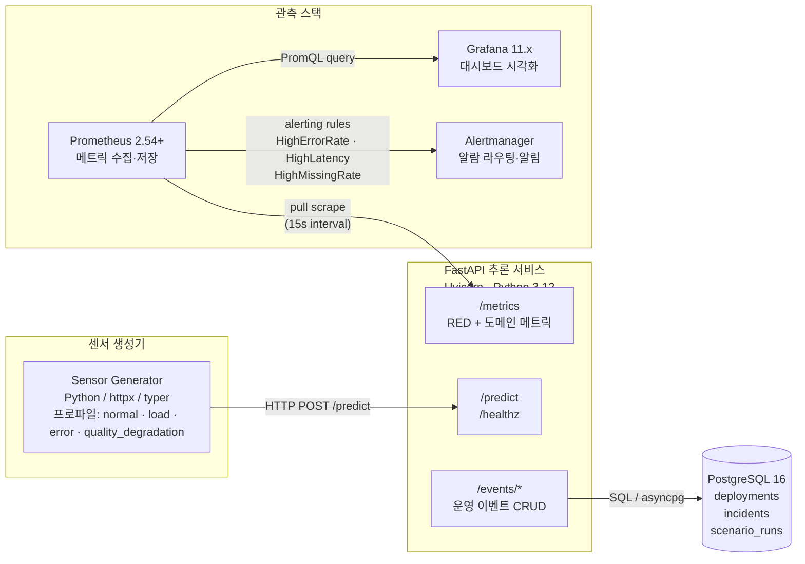
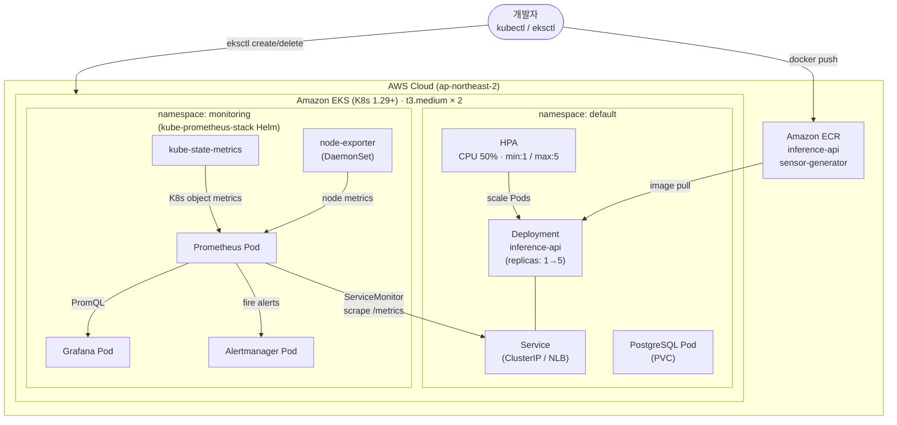

# 기술 스택 (Technology Stack)

> PRD 참조: EKS 기반 C4I-Style Sensor Anomaly Observability PoC

---

## 1. 추론 서비스 (Inference API)

| 구성 요소 | 기술 | 버전 (권장) | 선택 이유 |
|-----------|------|------------|-----------|
| 웹 프레임워크 | **FastAPI** | 0.115+ | 비동기 지원, 자동 OpenAPI 문서 생성, Pydantic 기반 입출력 검증. PRD 6.1 요구사항에 직접 부합. |
| ASGI 서버 | **Uvicorn** | 0.34+ | FastAPI 표준 ASGI 서버. `--workers` 옵션으로 멀티 프로세스 구성 가능. |
| 언어 | **Python** | 3.11+ | 데이터 처리 생태계(numpy/scipy) 활용 및 빠른 프로토타이핑. |
| 이상 탐지 로직 | **numpy + scipy** | numpy 1.26+, scipy 1.12+ | Z-score, IQR, 이동평균 기반 경량 통계 이상 탐지. 별도 ML 프레임워크(torch/sklearn) 불필요하여 이미지 경량화. |
| 메트릭 계측 | **prometheus-client** | 0.21+ | `/metrics` 엔드포인트 자동 노출. Histogram(latency), Counter(requests, errors), Gauge(도메인 메트릭) 지원. PRD 6.3 요구사항 충족. |
| 입출력 검증 | **Pydantic** | 2.x | FastAPI 내장. 센서 ID, timestamp, window 배열의 타입/범위 검증을 선언적으로 정의. |
| 테스트 | **pytest + httpx** | - | FastAPI AsyncClient 기반 단위/통합 테스트. 비동기 엔드포인트 테스트 지원. |

---

## 2. 합성 센서 스트림 생성기

| 구성 요소 | 기술 | 선택 이유 |
|-----------|------|-----------|
| 언어 | **Python 3.11+** | 추론 서비스와 동일 언어. 코드 공유(모델, 스키마) 가능. |
| 시계열 생성 | **numpy** | 사인파 + 가우시안 노이즈 조합으로 정상 패턴 생성. 스파이크, 드리프트, 결측, 지연을 파라미터 기반으로 주입. |
| HTTP 클라이언트 | **httpx** (async) | 비동기 요청으로 높은 동시성 달성. S1(부하 증가) 시나리오에서 RPS 조절 용이. |
| CLI 인터페이스 | **typer** | 시나리오별 파라미터(모드, RPS, 이상 비율, 결측률 등)를 커맨드라인으로 지정. `--help` 자동 생성. |
| 부하 생성 보조 | **locust** (선택) | S1 시나리오에서 수백 RPS 이상 필요 시 활용. 기본은 httpx 자체 asyncio 루프로 충분. |

---

## 3. 컨테이너 및 오케스트레이션

| 구성 요소 | 기술 | 선택 이유 |
|-----------|------|-----------|
| 컨테이너 빌드 | **Docker** (27+) | 멀티스테이지 빌드로 최종 이미지 경량화 (python:3.12-slim 기반). BuildKit 기본 활성화. |
| 컨테이너 레지스트리 | **Amazon ECR** | EKS와 동일 AWS 생태계 내 위치. IAM 기반 인증으로 별도 자격증명 불필요. 프라이빗 레지스트리. |
| 오케스트레이션 | **Amazon EKS** (K8s 1.29+) | PRD G1 요구사항. AWS 관리형 K8s로 컨트롤 플레인 운영 부담 제거. |
| 매니페스트 관리 | **Kustomize** | kubectl 내장. base/overlays 구조로 로컬-EKS 환경 분리. Helm 대비 학습 곡선 낮고 PoC에 적합. |
| 오토스케일링 | **HPA** | CPU 사용률 기반 자동 Pod 확장. PRD S1 시나리오 핵심. metrics-server 필수 의존. |
| 로컬 K8s (선택) | **kind** | Day 1-3에서 K8s 매니페스트 사전 검증. docker-compose가 주 환경이므로 선택 사항. |

---

## 4. 관측 스택 (Observability Stack)

| 구성 요소 | 기술 | 선택 이유 |
|-----------|------|-----------|
| 메트릭 수집/저장 | **Prometheus** (2.54+) | Pull 기반 메트릭 수집. PromQL 쿼리 언어로 알람 룰 및 대시보드 쿼리 작성. K8s 서비스 디스커버리 지원. |
| 시각화 | **Grafana** (11.x) | Prometheus 네이티브 데이터소스. 대시보드 JSON 프로비저닝으로 재현 가능한 시각화. PRD 6.4 요구사항. |
| 알람 라우팅 | **Alertmanager** | Prometheus alerting rules 연동. 알람 그루핑, 억제, 라우팅 지원. 웹훅/슬랙 알림. PRD 6.5 요구사항. |
| EKS 배포 | **kube-prometheus-stack** (Helm) | Prometheus + Grafana + Alertmanager + node-exporter + kube-state-metrics 일괄 배포. ServiceMonitor CRD로 타겟 자동 등록. |
| 로그 (선택) | **Loki** | PRD 10 오픈 이슈. MVP 범위 외. 시간 여유 시 알람 드릴다운용으로만 추가. |

---

## 5. 데이터 저장소

| 구성 요소 | 기술 | 선택 이유 |
|-----------|------|-----------|
| 운영 이벤트 DB | **PostgreSQL 16** | PRD 6.6 요구사항. JSONB 지원으로 유연한 메타데이터 저장. 로컬은 docker-compose 컨테이너, EKS는 Pod 내 PostgreSQL 또는 RDS. |
| ORM | **SQLAlchemy 2.0** + **asyncpg** | FastAPI 비동기 패턴과 자연스럽게 통합. 선언적 모델 정의. |
| 마이그레이션 | **Alembic** | 스키마 버전 관리. `alembic upgrade head`로 환경 간 일관된 스키마 적용. |

---

## 6. 인프라 프로비저닝

| 구성 요소 | 기술 | 선택 이유 |
|-----------|------|-----------|
| EKS 클러스터 생성 | **eksctl** | YAML 설정 파일 하나로 VPC + 서브넷 + 노드그룹 + EKS 일괄 생성. Terraform 대비 5일 PoC에서 셋업 시간 최소화. |
| 노드 구성 | **t3.medium** x 2 | 2 vCPU, 4 GiB RAM. PoC 최소 사양. 관측 스택 + 추론 서비스 동시 운영 가능. |
| AWS CLI | **aws-cli v2** | ECR 로그인, EKS kubeconfig 설정 등 AWS 리소스 접근. |
| 리소스 정리 | **eksctl delete cluster** | PRD 7 비용 요구사항. 데모 완료 즉시 전체 CloudFormation 스택 삭제. |

---

## 7. CI/CD (선택 사항)

| 구성 요소 | 기술 | 선택 이유 |
|-----------|------|-----------|
| CI | **GitHub Actions** | lint(ruff) + test(pytest) + Docker build 자동화. PoC에서는 최소 워크플로우만 구성. |
| CD | **수동 kubectl apply/rollout** | 5일 PoC에서 ArgoCD/Flux 등 GitOps 도입은 과도. `kubectl rollout undo`로 S2 롤백 시나리오 대응. |
| 이미지 태깅 | **Git SHA 기반** | `v1.0.0-abc1234` 형식. Deployment의 `app_version` 라벨과 연동하여 배포 추적. |

---

## 8. 로컬 개발 환경

| 구성 요소 | 기술 | 선택 이유 |
|-----------|------|-----------|
| 멀티 서비스 오케스트레이션 | **docker-compose** | 단일 `docker-compose up`으로 6개 서비스(추론 API, 생성기, Prometheus, Grafana, Alertmanager, PostgreSQL) 일괄 기동. |
| Python 환경 | **uv** | pip 대비 10-100배 빠른 의존성 설치. lockfile 기반 재현 가능한 환경. |
| 코드 품질 | **ruff** | linting + formatting 단일 도구 통합. isort/black/flake8 대체. |
| API 문서 | **Swagger UI** (FastAPI 내장) | `/docs` 엔드포인트에서 인터랙티브 API 테스트. |

---

## 9. 아키텍처 개요

### 9.1 시스템 컴포넌트 데이터 흐름

### 9.2 EKS 배포 토폴로지

---

## 10. 버전 호환성 매트릭스

| 컴포넌트 | 최소 버전 | 권장 버전 | 비고 |
|----------|----------|----------|------|
| Python | 3.11 | 3.12 | 3.13은 호환성 검증 후 사용 |
| FastAPI | 0.115 | 최신 | Pydantic v2 필수 |
| Kubernetes | 1.28 | 1.29+ | EKS 지원 버전 기준 |
| Prometheus | 2.50+ | 2.54+ | kube-prometheus-stack 번들 기준 |
| Grafana | 10.x | 11.x | 대시보드 JSON 프로비저닝 호환 |
| PostgreSQL | 15 | 16 | Docker 공식 이미지 기준 |
| Docker | 24+ | 27+ | BuildKit 기본 활성화 |
| eksctl | 0.190+ | 최신 | EKS 1.29 지원 필수 |
| Helm | 3.14+ | 3.16+ | kube-prometheus-stack 설치용 |
